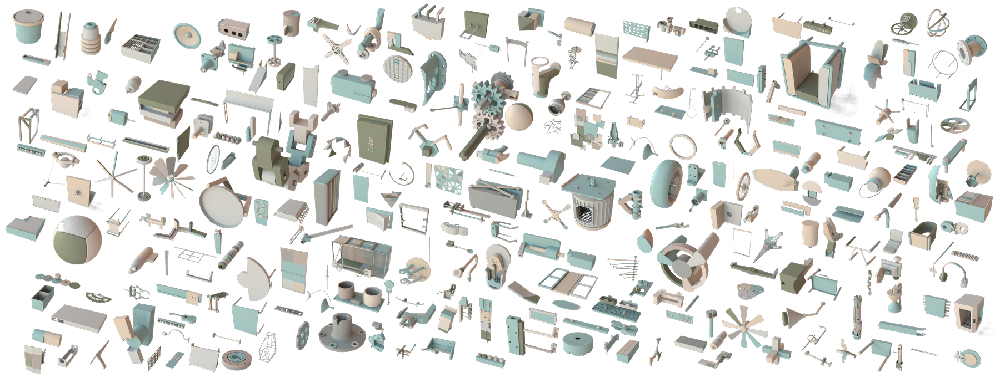
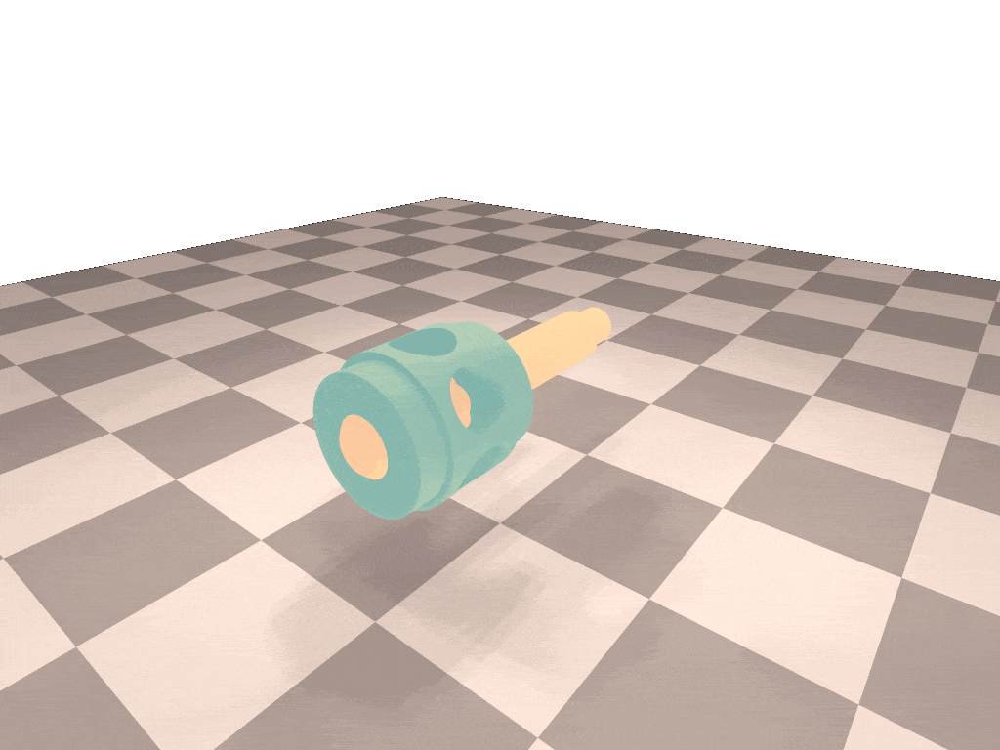
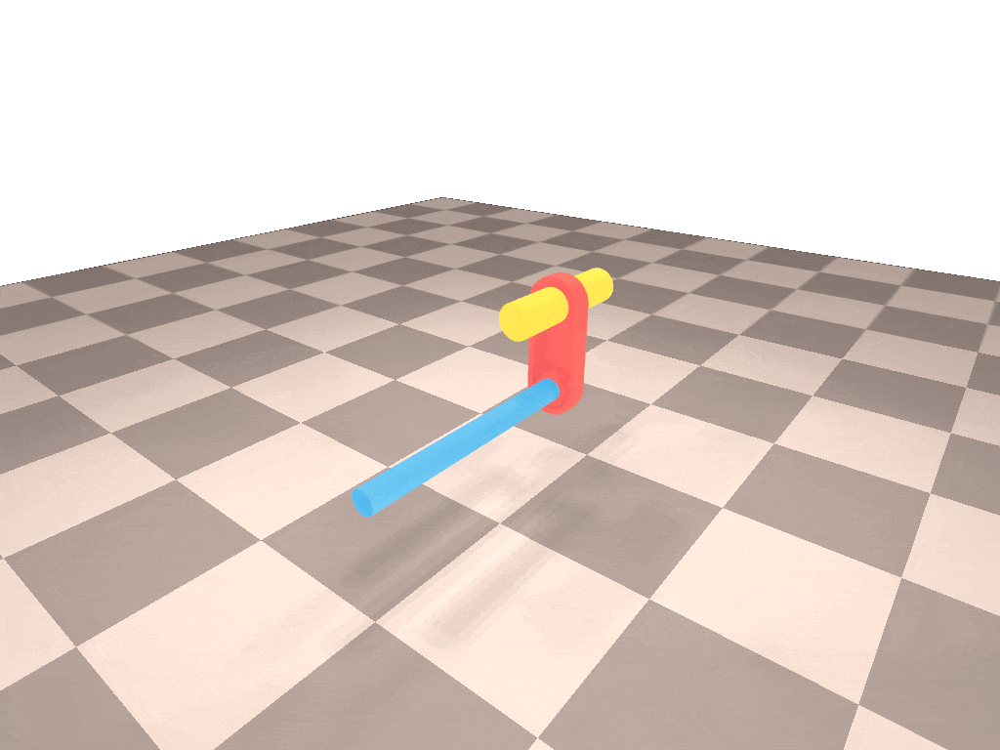
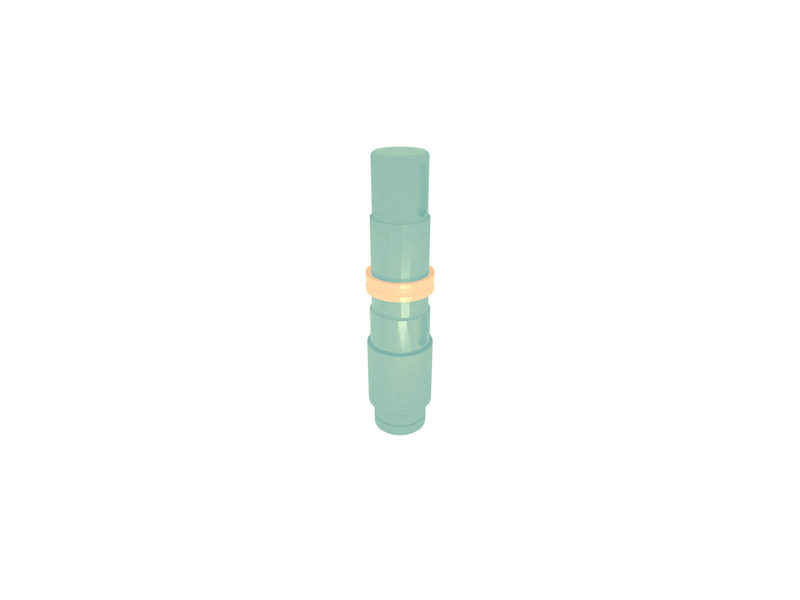
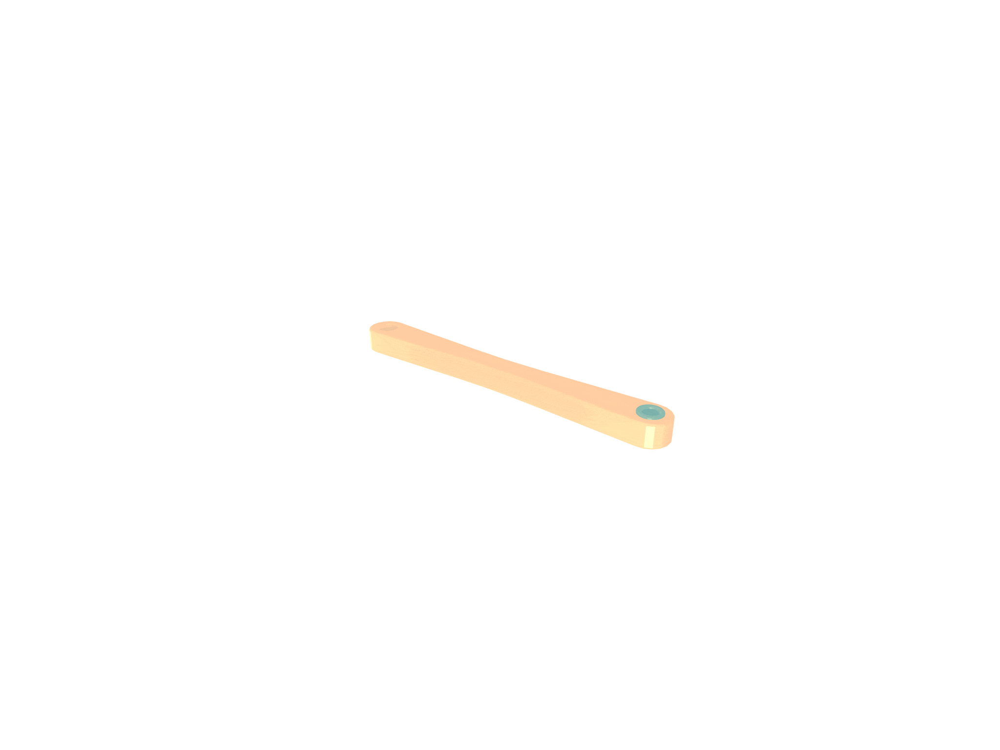

# Assemble-Them-All

This repository contains the official code and dataset of [Assemble Them All: Physics-Based Planning for Generalizable Assembly by Disassembly (SIGGRAPH Asia 2022)](http://assembly.csail.mit.edu/). 


**Authors**: Yunsheng Tian, Jie Xu, Yichen Li, Jieliang Luo, Shinjiro Sueda, Hui Li, Karl D.D. Willis, Wojciech Matusik

**Summary**: In this work, we propose a novel method to efficiently plan physically plausible assembly motion and sequences for real-world assemblies. Our method leverages the assembly-by-disassembly principle and physics-based simulation to efficiently explore a reduced search space. We also define a large-scale dataset consisting of thousands of physically valid industrial assemblies with a variety of assembly motions required.

**News**:

- Easier input preparation for your custom assemblies: `translation.json` is no longer required for your assembly assets as long as the meshes are already in assembled states, and file names can be arbitrary (do not have to be integer anymore) (03/2024).

- We provide instructions [here](https://github.com/yunshengtian/Assemble-Them-All#custom-assembly-usage) for applying the algorithm on your custom meshes (03/2023).

## Installation

### 1. Clone repository (with dependencies)

```
git clone --recurse-submodules git@github.com:yunshengtian/Assemble-Them-All.git
```

### 2. Setup Python environment

```
conda env create -f environment.yml
conda activate assembly
```

**Note 1:** The package versions are critical to making sure the code runs smoothly.

**Note 2:** If you prefer setting up through docker, [here](https://hub.docker.com/r/changyun/assemble-them-all) is a docker image from [Issue #1](https://github.com/yunshengtian/Assemble-Them-All/issues/1#issuecomment-1360959428).

### 3. Install simulation bindings

```
cd simulation
python setup.py install
```

**Note 1:** [CMake](https://cmake.org/) version > 3.16.0 is required.

**Note 2:** For Linux, please run `sudo apt-get install libgl1-mesa-dev xorg-dev` before this step.

**Note 3**: Our simulation code is built upon [DiffRedMax](https://github.com/eanswer/DiffHand) and inherits its nice differentiability. Welcome to check it out!

### 4. Install assembly datasets



Our datasets are available at the links below (in .zip). Unzip them and place the folders under ``assets/`` of this code repository (recommended location, not required). 

[[Two-part main dataset (221.1MB)]](https://people.csail.mit.edu/yunsheng/Assemble-Them-All/dataset_2403/joint_assembly.zip) [[Two-part rotational dataset (5.4MB)]](https://people.csail.mit.edu/yunsheng/Assemble-Them-All/dataset_2403/joint_assembly_rotation.zip) [[Multi-part dataset (778.4MB)]](https://people.csail.mit.edu/yunsheng/Assemble-Them-All/dataset_2403/multi_assembly.zip)

**Note 1:** Since a large portion of our dataset is modified from the [Fusion 360 Gallary Dataset](https://github.com/AutodeskAILab/Fusion360GalleryDataset), please refer to the [Fusion 360 Gallery Dataset License](https://github.com/AutodeskAILab/Fusion360GalleryDataset/blob/master/LICENSE.md) for legal usage.

**Note 2:** For point-based SDF collision check to work more accurately, we highly recommend subdividing the assembly meshes to have denser contact points by running ``assets/subdivide_batch.py`` (as we did in our experiments). For example, to subdivide the two-part assembly dataset saved in ``assets/joint_assembly`` and export to ``assets/joint_assembly_dense``:

```
python assets/subdivide_batch.py --source-dir assets/joint_assembly --target-dir assets/joint_assembly_dense --num-proc NUM_PROCESSES
```

To parallelize the subdivision, specify ``--num-proc`` with your preferred number of processes accordingly. After subdivision, please specify the new dataset directories for ``--dir`` argument to run the experiment scripts (see "Experiments" section below).

### 5. Test simulation

To verify if the installation steps are successful, run the following commands to test the two-part and multi-part assembly simulation respectively:

```
python examples/test_joint_sim.py --dir joint_assembly --id 00016 --gravity 9.8 --steps 2000
python examples/test_multi_sim.py --dir multi_assembly --id 00031 --gravity 9.8 --steps 2000
```

Then the simulation viewer will show up and produce the following animation:

|          00016 (two-part)           |         00031 (multi-part)          |
| :---------------------------------: | :---------------------------------: |
|  |  |

## Simulation Viewer

Some tips to interact with the simulation viewer:

- Scroll your mouse wheel to zoom in/out.
- Move your mouse while holding down the left mouse button to rotate the camera.
- Move your mouse while holding down ``Shift`` + left mouse button to move around the scene.
- Press ``S`` to slow down and ``F`` to speed up the simulation.
- Press ``Space`` to pause/resume the simulation.

## Experiments

### 1. Two-part assembly planning - single assembly

See below for commands and arguments for path planning on a single two-part assembly.

**Physics-based planning**

```
python examples/run_joint_plan.py --planner PLANNER --dir ASSEMBLY_DIR --id ASSEMBLY_ID
```

- ``--planner``: Path planning method. Choices: ``bfs`` (our method), ``bk-rrt``.

**Geometric-sampling-based planning**

```
python baselines/run_joint_plan.py --planner PLANNER --dir ASSEMBLY_DIR --id ASSEMBLY_ID
```

- ``--planner``: Path planning method. Choices: ``rrt``, ``rrt-connect``, ``birrt``, ``trrt``, ``matevec-trrt``.

**Other important arguments**

- ``--dir``: Directory of the two-part assembly dataset (e.g. ``joint_assembly`` if the dataset location is ``assets/joint_assembly``).
- ``--id``: Assembly id in the dataset (e.g. ``00000``).
- ``--rotation``: Add this argument if the assembly requires rotational motion.
- ``--max-time``: Planning timeout (in seconds, 120 by default).
- ``--render``: Add this argument to render the planned result.

For details on more arguments, please refer to the code. Below are some example animations that can be produced by the commands above.

|                   00007                   |                   00009                   |                   00016                   |
| :---------------------------------------: | :---------------------------------------: | :---------------------------------------: |
|  |  |  |

### 2. Two-part assembly planning - whole dataset

See below for commands and arguments for path planning on the whole two-part assembly dataset.

**Physics-based planning**

```
python examples/run_joint_plan_batch.py --planner PLANNER --dir ASSEMBLY_DIR --log-dir LOG_DIR
```

**Geometric-sampling-based planning**

```
python baselines/run_joint_plan_batch.py --planner PLANNER --dir ASSEMBLY_DIR --log-dir LOG_DIR
```

**Important arguments**

- ``--log-dir``: Directory to store the log files containing statistics of experiments.

For other arguments, see details in section "Two-part assembly planning - single assembly" above.

### 3. Multi-part assembly planning - single assembly

See below for commands and arguments for sequence (and path) planning on a single multi-part assembly.

**Physics-based planning**

```
python examples/run_multi_plan.py --seq-planner SEQ_PLANNER --path-planner PATH_PLANNER --dir ASSEMBLY_DIR --id ASSEMBLY_ID
```

- ``--seq-planner``: Sequence planning method. Choices: ``random``, ``queue``, ``prog-queue`` (our method).
- ``--path-planner``: Path planning method. Choices: ``bfs`` (our method), ``bk-rrt``.

**Geometric-sampling-based planning**

```
python baselines/run_multi_plan.py --seq-planner SEQ_PLANNER --path-planner PATH_PLANNER --dir ASSEMBLY_DIR --id ASSEMBLY_ID
```

- ``--seq-planner``: Sequence planning method. Choices: ``random``, ``queue`` (recommended).
- ``--path-planner``: Path planning method. Choices: ``rrt``, ``rrt-connect``, ``birrt``, ``trrt``, ``matevec-trrt``.

**Other important arguments**

- ``--dir``: Directory of the multi-part assembly dataset (e.g. ``multi_assembly`` if the dataset location is ``assets/multi_assembly``).
- ``--id``: Assembly id in the dataset (e.g. ``00000``).
- ``--rotation``: Add this argument if the assembly requires rotational motion.
- ``--seq-max-time``: Timeout for the whole sequence planning (in seconds, 3600 by default) with path planning in the loop.
- ``--path-max-time``: Timeout for the each path planning (in seconds, 120 by default).
- ``--render``: Add this argument to render the planned result.

For details on more arguments, please refer to the code. Below are some example animations that can be produced by the commands above.

|               00031 (step 1)                |               00031 (step 2)                |
| :-----------------------------------------: | :-----------------------------------------: |
|  |  |

### 4. Multi-part assembly planning - whole dataset

See below for commands and arguments for sequence (and path) planning on the whole multi-part assembly dataset.

**Physics-based planning**

```
python examples/run_multi_plan_batch.py --seq-planner SEQ_PLANNER --path-planner PATH_PLANNER --dir ASSEMBLY_DIR
```

**Geometric-sampling-based planning**

```
python baselines/run_multi_plan_batch.py --seq-planner SEQ_PLANNER --path-planner PATH_PLANNER --dir ASSEMBLY_DIR
```

**Important arguments**

- ``--log-dir``: Directory to store the log files containing statistics of experiments.

For other arguments, see details in section "Multi-part assembly planning - single assembly" above.

## Custom Assembly Usage

To run the algorithm on your custom assembly meshes, some pre-processing on the meshes need to be done since the meshes could be of arbitrary scales and the vertex density of meshes may not be enough for accurate point-based collision checking.

We provide a pre-processing script `assets/process_mesh.py` that rescales the custom meshes to provide an unified input to the algorithm. Assume you have a set of .obj meshes placed under `source_dir/` that form an assembly and are all in the assembled states. Run:

```
python assets/process_mesh.py --source-dir source_dir/ --target-dir target_dir/ --subdivide
```

Then, all the pre-processed meshes will be written to the output directory `target_dir/`. 

To run our algorithm on top of them, just specify `--dir` and `--id` accordingly for the scripts in the above [Experiments section](https://github.com/yunshengtian/Assemble-Them-All#experiments) to make sure they can find `target_dir/`.

## Contact

Please feel free to contact yunsheng@csail.mit.edu or create a GitHub issue for any questions about the code or dataset.

## Citation

If you find our paper, code or dataset is useful, please consider citing:

```
@article{tian2022assemble,
    title={Assemble Them All: Physics-Based Planning for Generalizable Assembly by Disassembly},
    author={Tian, Yunsheng and Xu, Jie and Li, Yichen and Luo, Jieliang and Sueda, Shinjiro and Li, Hui and Willis, Karl D.D. and Matusik, Wojciech},
    journal={ACM Trans. Graph.},
    volume={41},
    number={6},
    articleno={278},
    numpages={15},
    year={2022},
    publisher={ACM}
}
```

If the simulation is particularly useful, please consider also citing:

```
@INPROCEEDINGS{Xu-RSS-21, 
    AUTHOR    = {Jie Xu AND Tao Chen AND Lara Zlokapa AND Michael Foshey AND Wojciech Matusik AND Shinjiro Sueda AND Pulkit Agrawal}, 
    TITLE     = {{An End-to-End Differentiable Framework for Contact-Aware Robot Design}}, 
    BOOKTITLE = {Proceedings of Robotics: Science and Systems}, 
    YEAR      = {2021}, 
    ADDRESS   = {Virtual}, 
    MONTH     = {July}, 
    DOI       = {10.15607/RSS.2021.XVII.008} 
} 
```
